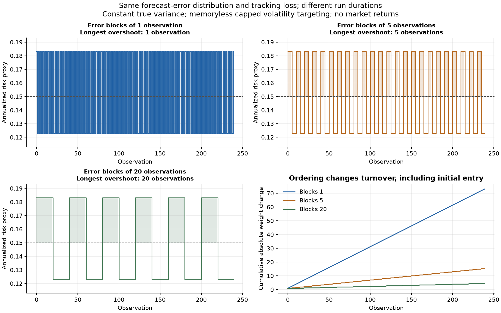
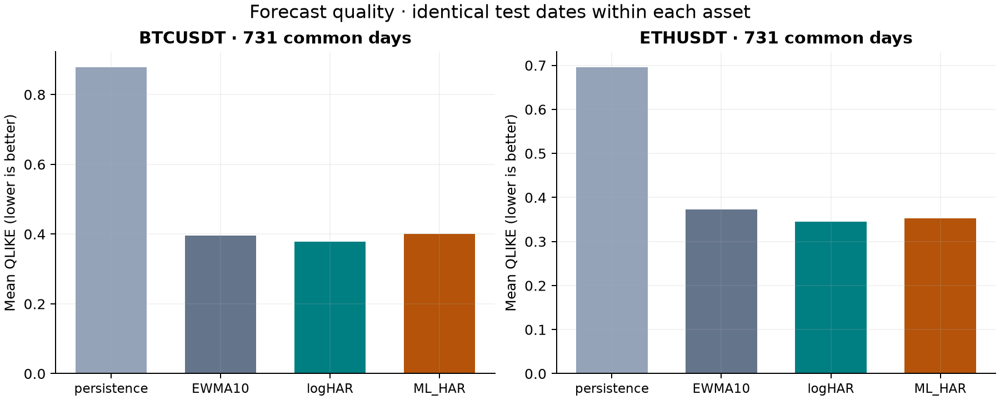

# Volatility Forecast and Risk Lab

A Python research project about **forecasting market volatility and controlling
portfolio risk**. It uses Bitcoin and Ethereum price data, compares four forecast
models, and tests five rules for splitting money between an asset and cash.

The main question is simple: **If a model keeps predicting too little risk, can
its past mistakes help us choose a better position size?**

The code, tests, data checks, charts, and full results are included. The Python
package and command are called `volrisklab`.

[Results](reports/generated/RESULTS.md) · [Study plan](docs/protocol.md) ·
[Math](docs/theory.md) · [References](docs/references.md)

## What this project does

1. Downloads public five-minute Bitcoin and Ethereum price data from Binance Vision.
2. Checks file hashes, timestamps, and missing records.
3. Builds one daily measure of price variation from the five-minute returns.
4. Compares simple statistical forecasts with a small machine learning model.
5. Uses the forecasts to set daily asset and cash weights, then runs a historical
   test with trading costs.
6. Saves results, charts, model settings, and file hashes so the work can be checked
   and repeated.

There is also a small experiment with made-up data. It keeps the same forecast
errors but changes their order. This helps separate the size of an error from
how long a bad run lasts.

## Main findings

**The extra correction rule did not improve risk control in the final test.**

The rule raises the risk forecast after recent forecasts have been too low. The
code calls this rule the **residual buffer**. It was compared with a simple rule
that reduces position size by a fixed proportion. That proportion was set using
the validation data.

On the combined 2024–2025 test data, the buffer had a higher average risk-tracking
loss by **0.002800**. Higher is worse. A descriptive 95% interval from resampling
14-day blocks was **[0.001242, 0.004684]**. These numbers measure risk error; they
are not returns or percentage points.

Two other findings:

- In the made-up-data experiment, the same errors produced runs above the risk
  target lasting **1, 5, or 20 days**. Average forecast loss and average daily risk
  loss stayed the same. Trading activity changed too.
- The small machine learning model did not beat the linear HAR model on the
  main forecast score for either asset in the test period.

The negative result is kept. The project shows a complete research process and
what this particular experiment found. It does not establish a profitable
trading strategy or a new forecasting method.



## Data and test design

| Part | Choice |
| --- | --- |
| Assets | BTCUSDT and ETHUSDT spot prices from Binance Vision |
| Data | Five-minute price bars, January 2019 to December 2025 |
| Size | 168 monthly files; 1,471,204 price bars in total |
| Initial training | 2019–2021 |
| Validation: choose rule settings | 2022–2023 |
| Final historical test | 2024–2025; 731 days per asset |
| Model updates | Refit each month with the available past data |
| Risk target | 15% annual volatility; asset weight between 0% and 100% |

At the start of day `t`, forecasts and correction rules use data through `t-2`.
One full day is left for processing. This is a two-day-ahead forecast. The monthly
refit rule is fixed; model settings are not selected using final-test results.

There are 814 missing five-minute bars per asset. The code does not fill these
gaps. It marks incomplete daily risk measures as missing and uses the same valid
test dates when comparing forecast models. The data has 2,535 valid daily risk
measures per asset; millions of price bars do not mean millions of daily samples.

## Models and position rules

| Forecast model | What it uses |
| --- | --- |
| Persistence | The latest available daily variance |
| EWMA | A weighted average that gives more weight to recent days |
| Log-HAR | A linear model using daily, five-day, and 22-day variance measures |
| ML-HAR | A small gradient boosting model using the same three inputs as HAR |

Variance measures how much returns move. Volatility is its square root. Here,
daily realized variance is the sum of squared five-minute log returns.

The five position rules are direct risk targeting, gradual position changes,
a no-trade band for small changes, the residual buffer, and a fixed reduction
in position size. The linear HAR model was chosen for this comparison before
the final test.

The backtest includes changes in portfolio weights caused by price moves,
opening price gaps, and trading costs. It uses no leverage, takes no short
positions, and gives cash zero interest. Costs of 0, 5, 10, and 20 basis points
are assumed cases; 10 basis points means 0.1% of the amount traded.



## Run it

Use Python 3.12 to match the tested setup. Python 3.11 or later is supported.
Run these commands from the repository folder:

```bash
python3 -m venv .venv
source .venv/bin/activate
python -m pip install -r requirements-lock.txt
python -m pip install -e . --no-deps

# Run the small experiment without downloading market data.
volrisklab simulate

# Run the tests.
pytest

# Download and check the market data, then run the full study.
volrisklab data
volrisklab run
```

On Windows, replace the activation command with `.venv\Scripts\activate` in
Command Prompt. No API key or GPU is needed.

The full run writes its report, charts, and tables to `reports/generated/`.
The offline experiment writes to `reports/simulation/`. The raw archive cache
for this study is below 200 MB. Download time depends on the network connection.

The downloader checks published file hashes. If the provider changes a saved
data file, it stops with a hash error so the change is visible. Full daily data
and position files are kept locally and are excluded from Git.

For development, use `python -m pip install -e ".[dev]"`. This installs compatible
package versions rather than the exact recorded versions. GitHub Actions runs
the tests, code checks, and offline experiment.

## Code map

| File or folder | Purpose |
| --- | --- |
| `src/volrisklab/data.py` | Download, check, and prepare data |
| `src/volrisklab/forecast.py` | Build inputs and fit forecast models |
| `src/volrisklab/decisions.py` | Set positions and calculate portfolio results |
| `src/volrisklab/analysis.py` | Run comparisons and estimate uncertainty |
| `src/volrisklab/simulation.py` | Run the experiment with made-up data |
| `src/volrisklab/reporting.py` | Create charts and the results report |
| `tests/` | Check timing, missing data, portfolio calculations, and model behavior |
| `configs/study.json` | Store the study settings and date ranges |
| `docs/` | Explain the study plan, math, references, and research choices |
| `reports/generated/` | Store the completed study's results and data records |

## Limits

The study uses two selected assets, one exchange, and two final test years. The
assets share market conditions and some missing-data dates. They are not
independent experiments.

The risk score is an estimate based on the opening position and that day's
realized variance. It does not describe every change in risk during the day.
Trading prices and costs are assumptions, not records of real orders.

The uncertainty intervals describe this sample and these fitted models. They
do not include every source of uncertainty. The final test results have now
been viewed; changes based on them would need to be labelled exploratory and
checked on new data.

## License and data source

The original code and made-up-data experiment use the [MIT license](LICENSE).
Market data comes from **Binance Vision**. Results, tables, charts, and findings
based on that data use **CC BY-NC-SA 4.0** under the provider's terms. See
[DATA_LICENSE.md](DATA_LICENSE.md) for attribution and details.
