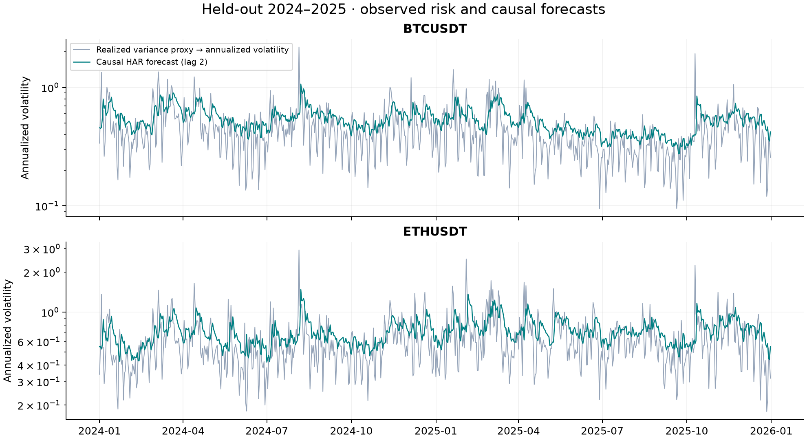
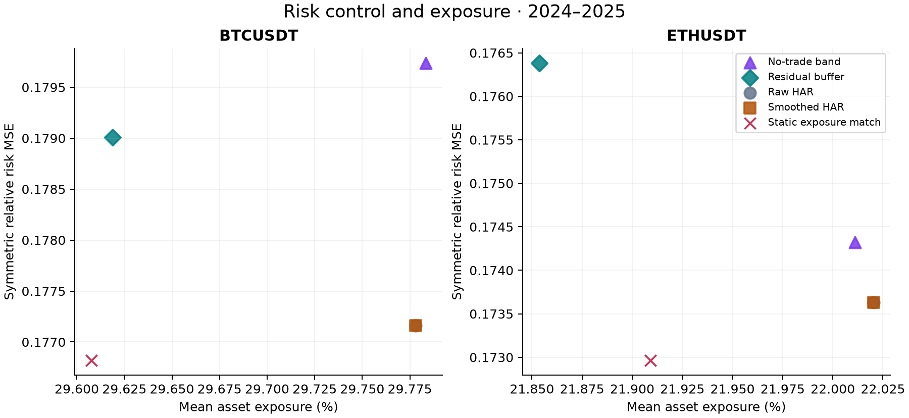
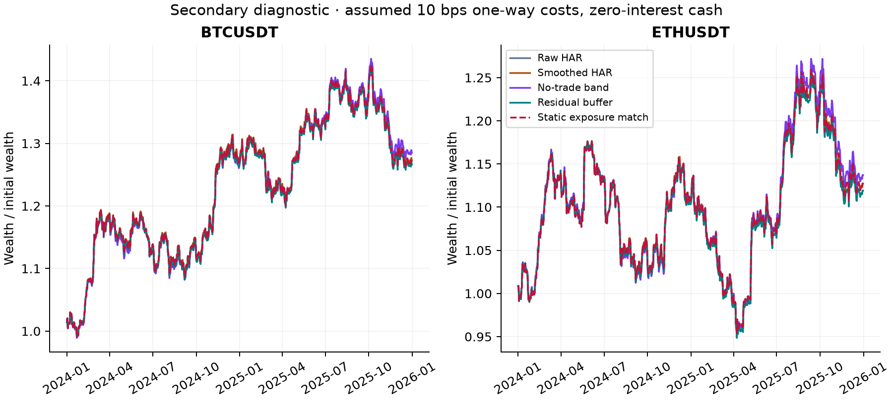

# VolRiskLab — research results

## Finding

The buffer increased the primary held-out risk loss relative to the validation exposure-matched static control; the 14-day descriptive bootstrap interval lies above zero. This is a negative result for the proposed correction.

The prespecified primary contrast is **buffer minus static exposure-matched control**,
mean squared relative risk deviation, averaged on common days over both assets.
It uses zero-cost accounting paths; the displayed scenario tables use 10 bps.
Negative is better. Estimate: **0.002800**;
14-day block-bootstrap 95% interval: **[0.001242, 0.004684]**.
All intervals and other comparisons are retained in `risk_comparisons.csv`.

This is an executed, reproducible research project. It is not a submitted paper,
a demonstrated trading edge, or a claim of a novel forecasting architecture.

## Question and design

Can temporally clustered volatility underprediction extend risk-target overshoot?
Does a feedback rule based only on previously observed residuals improve decisions
beyond a static reduction in exposure, simple smoothing, and a no-trade band?

The [protocol](../../docs/protocol.md) and [configuration](../../configs/study.json)
were fixed before market-model evaluation. They were not externally preregistered.
Two surviving large cryptoassets are deliberately small case studies.
2019–2021 initializes estimation, 2022–2023 selects policy parameters, and
2024–2025 is the historical held-out evaluation. Expanding monthly refits use
newly observed past targets in test; hyperparameters are not retuned on test.

## Data and audit

| symbol | raw_rows | days | valid_rv_days | missing_bars |
| --- | --- | --- | --- | --- |
| BTCUSDT | 735602 | 2557 | 2535 | 814 |
| ETHUSDT | 735602 | 2557 | 2535 | 814 |

Source: [Binance Vision](https://github.com/binance/binance-public-data), spot
5-minute OHLCV archives, UTC, January 2019–December 2025. All 168 archives are
verified against their vendor SHA256 sidecars. `data_manifest.json` preserves
URLs, hashes and retrieval times. `data_audit.json` lists missing intervals.
2025 microsecond timestamps and earlier millisecond timestamps are normalized.
No missing bars are interpolated and no return bridges a missing interval.
The first dataset day lacks a prior closing observation and has no valid RV.
The two assets share venue outage dates; they are not independent replications.

RV is the sum of 288 consecutive squared 5-minute log returns, attributed to the
UTC day of the ending bar. Incomplete days retain missing RV. They remain on
the calendar. Forecast and risk metrics exclude invalid targets; financial
accounting still keeps days with observed exact opening/closing boundaries.
Missing forecasts trigger a hold of existing shares, not a fictitious liquidation.

## Forecasts: the actual machine learning component

Persistence and EWMA(span 10) provide low-cost controls. Log-HAR uses linear
regression on log daily, five-day and 22-day mean RV. ML_HAR uses a small histogram
gradient boosting model with **the identical three features**. Its purpose is
to test a nonlinear mapping, not a richer information set. Log predictions use
training-residual smearing to return to the variance scale.

At the opening of held day t, all predictors and feedback stop at t−2. This leaves
one full processing day and is deliberately slower than an ideal production
pipeline. It is a two-calendar-day-ahead target, not a conventional lag-one HAR
benchmark. Models refit monthly; archived issued forecasts generate feedback.
Training-only smearing is not a guarantee of out-of-sample calibration.

QLIKE = RV/f − log(RV/f) − 1. Lower is better. All four models use common valid
target dates within each asset for this table; the number of observations is
daily, not the number of five-minute bars.

| symbol | model | valid_days | qlike | log_mse | log_error_acf1 | underprediction_max_run |
| --- | --- | --- | --- | --- | --- | --- |
| BTCUSDT | EWMA10 | 731 | 0.3957 | 0.7884 | 0.4223 | 7 |
| BTCUSDT | ML_HAR | 731 | 0.4012 | 0.9057 | 0.3872 | 7 |
| BTCUSDT | logHAR | 731 | 0.3782 | 0.9505 | 0.3588 | 5 |
| BTCUSDT | persistence | 731 | 0.8786 | 1.2175 | 0.2204 | 5 |
| ETHUSDT | EWMA10 | 731 | 0.3730 | 0.6896 | 0.4665 | 7 |
| ETHUSDT | ML_HAR | 731 | 0.3522 | 0.7558 | 0.3925 | 6 |
| ETHUSDT | logHAR | 731 | 0.3449 | 0.7544 | 0.3754 | 6 |
| ETHUSDT | persistence | 731 | 0.6959 | 0.9446 | 0.2185 | 6 |

## Controlled mechanism experiment

Under constant true variance and memoryless volatility targeting, rearranging an
identical multiset of forecast errors leaves every mean pointwise loss unchanged.
It changes the sequence of weights, overshoot run lengths, and turnover. Therefore
"persistent errors are worse" needs an explicit path-dependent loss definition.
This elementary invariant is a diagnostic, not a claimed new theorem.

| scenario | mean_qlike | risk_tracking_mse | longest_overshoot_run | total_turnover |
| --- | --- | --- | --- | --- |
| alternating | 0.0811 | 0.0009 | 1 | 73.0950 |
| blocks_5 | 0.0811 | 0.0009 | 5 | 15.1102 |
| blocks_20 | 0.0811 | 0.0009 | 20 | 4.2381 |

The simulation's `risk_tracking_mse` is squared **absolute annualized volatility** error;
the empirical `risk_mse` below is squared **relative** error. Their scales differ
by target-volatility squared. See [the derivation](../../docs/theory.md).

## Policies and validation selection

The primary decision model was fixed to logHAR before testing. Asset and cash are
unlevered; target annual volatility is 15%, using 365-day annualization. Cash earns
zero. The residual buffer multiplies forecast variance by exp(gamma × score),
where score is the positive part of a trailing five-day mean log(RV/issued forecast),
clipped at log(4), and delayed two days. A nonzero score captures recent positive
bias; it does not uniquely identify the persistence mechanism.

Selected parameters: `{"band": 0.03, "buffer": 0.5, "raw": 1.0, "smooth": 1.0, "static_scales": {"BTCUSDT": 0.994276949778012, "ETHUSDT": 0.994945116356817}}`.

Selection minimizes validation symmetric relative risk MSE + 0.1 × daily turnover,
equally averaged across assets. The symmetry penalizes avoiding risk by sitting
entirely in cash. Selection and static exposure matching use zero-cost validation
paths. The static multiplier matches the buffer's mean validation exposure for
each asset and is then frozen. Test exposure is reported, not forcibly matched.
All candidate trials are in `validation_trials.csv`, including gamma = 0.

## Held-out risk and exposure

| symbol | policy | risk_mse | overshoot_fraction | overshoot_mean_run | overshoot_max_run | mean_exposure | daily_turnover |
| --- | --- | --- | --- | --- | --- | --- | --- |
| BTCUSDT | band | 0.1797 | 0.2531 | 1.7619 | 5 | 0.2978 | 0.0161 |
| BTCUSDT | buffer | 0.1790 | 0.2503 | 1.7429 | 5 | 0.2962 | 0.0234 |
| BTCUSDT | raw | 0.1772 | 0.2544 | 1.7383 | 5 | 0.2978 | 0.0226 |
| BTCUSDT | smooth | 0.1772 | 0.2544 | 1.7383 | 5 | 0.2978 | 0.0226 |
| BTCUSDT | static | 0.1768 | 0.2503 | 1.7264 | 5 | 0.2961 | 0.0224 |
| ETHUSDT | band | 0.1743 | 0.2791 | 2.0198 | 5 | 0.2201 | 0.0122 |
| ETHUSDT | buffer | 0.1764 | 0.2777 | 1.9902 | 6 | 0.2185 | 0.0201 |
| ETHUSDT | raw | 0.1736 | 0.2804 | 1.9903 | 6 | 0.2202 | 0.0193 |
| ETHUSDT | smooth | 0.1736 | 0.2804 | 1.9903 | 6 | 0.2202 | 0.0193 |
| ETHUSDT | static | 0.1730 | 0.2736 | 1.9417 | 6 | 0.2191 | 0.0192 |

The daily proxy is opening weight × sqrt(365 × RV), divided by the 15% target.
This is an ex-post risk diagnostic, not conditional volatility or a risk probability.
It does not reconstruct within-day portfolio-weight drift or the previous position's
opening-gap risk. Missing-risk days break run counts, potentially shortening them.
The financial return calculation separately includes overnight gaps and holding drift.

Primary comparison, with alternative block lengths:

| block_days | valid_days | mean_difference | ci_low | ci_high |
| --- | --- | --- | --- | --- |
| 7 | 731 | 0.002800 | 0.001285 | 0.004401 |
| 14 | 731 | 0.002800 | 0.001242 | 0.004684 |
| 28 | 731 | 0.002800 | 0.001308 | 0.004593 |

Paired circular moving-block resampling uses the same dates across assets and
keeps missing calendar positions. These percentile intervals are conditional on
the fitted forecasts, selected rules, and historical sample. They do not repeat
estimation or selection and are not distribution-free guarantees under regime
changes. Other contrasts are exploratory; no multiple-comparison correction.

## Secondary financial diagnostics

Assumed cost: 10 bps per one-way traded notional, with exact self-financing cost
accounting and pretrade weights drifted by asset returns. The first purchase is
charged. Terminal wealth marks remaining holdings to market without liquidation.
The daily bar open is a reference price, not verified execution. OHLCV cannot
identify actual spreads, market impact, queue fills, or strategy capacity.

| symbol | policy | net_total_return | net_sharpe | max_drawdown |
| --- | --- | --- | --- | --- |
| BTCUSDT | band | 0.2850 | 0.9893 | -0.1108 |
| BTCUSDT | buffer | 0.2660 | 0.9402 | -0.1160 |
| BTCUSDT | raw | 0.2724 | 0.9516 | -0.1156 |
| BTCUSDT | smooth | 0.2724 | 0.9516 | -0.1156 |
| BTCUSDT | static | 0.2708 | 0.9516 | -0.1150 |
| ETHUSDT | band | 0.1370 | 0.4909 | -0.1907 |
| ETHUSDT | buffer | 0.1191 | 0.4409 | -0.1935 |
| ETHUSDT | raw | 0.1273 | 0.4622 | -0.1910 |
| ETHUSDT | smooth | 0.1273 | 0.4622 | -0.1910 |
| ETHUSDT | static | 0.1267 | 0.4622 | -0.1901 |

`net_total_return` covers the two-year test period, not one year. Sharpe uses zero
cash interest and sqrt(365). Cost scenarios 0/5/10/20 bps are all preserved in
`decision_metrics.csv`; costs are assumptions, not observed transaction expenses.

## Interpretation and limits

1. Temporal ordering can alter duration and turnover without changing average
   error. The controlled experiment establishes only this limited mechanism.
2. The empirical correction also changes forecast level and exposure. The static
   control helps diagnose that confound but does not exactly equalize test exposure.
3. This is risk allocation, not return prediction or evidence of alpha. A higher
   historical Sharpe alone is not the study's success criterion.
4. Only two selected assets, one venue and two final test years are evaluated.
   Archived data can be revised; saved hashes identify this snapshot, not a
   point-in-time database. Five-minute RV is a noisy proxy for latent variance.
5. The learned model is intentionally small. Millions of bars produce only
   thousands of daily labels; five-minute rows are not independent daily samples.
6. Novelty and a publishable contribution have not been established. See
   [related work](../../docs/references.md) for directly overlapping literature.

## Reproduction and licensing

From the repository root: `volrisklab data`, then `volrisklab run`.
An offline mechanism demo is `volrisklab simulate`. Run `pytest` for timing,
missing-data, accounting and invariant checks. Exact environment and source/data
hashes are recorded in `run_provenance.json` and `requirements-lock.txt` at repo root.
Raw data and full per-day paths are excluded from the publication bundle; commands
regenerate them. Code uses the MIT license; market-derived outputs in this directory
are attributed to Binance Vision and supplied under CC BY-NC-SA 4.0 as documented
in [DATA_LICENSE](../../DATA_LICENSE.md). This is noncommercial research.
